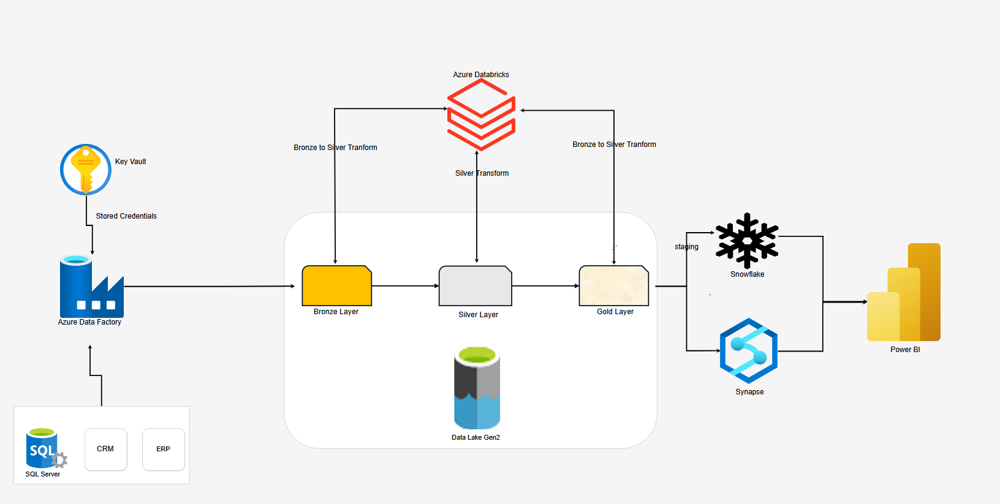

#  Moderne Datenarchitektur auf Azure (Medallion Architecture)

Konzeption, Entwicklung und Wartung einer modernen, skalierbaren Datenarchitektur auf Azure, basierend auf dem Medallion-Architekturmodell (Bronze – Silver – Gold). Daten aus verschiedenen Quellsystemen (SQL Server, CRM, ERP) werden über Azure Data Factory extrahiert, sicher über Azure Key Vault authentifiziert und in Azure Data Lake Gen2 abgelegt. Die Verarbeitung und Transformation erfolgen schrittweise mit Azure Databricks, bevor die Daten in Snowflake und Azure Synapse Analytics für Analysezwecke bereitgestellt werden. Power BI dient schließlich als Frontend zur Visualisierung der aufbereiteten Daten. Die Integration von Snowflake ermöglicht ein performantes analytisches Layering.

---

## Architektur 

  

---

Die gesamte Infrastruktur wird über Infrastructure as Code mit Terraform bereitgestellt und im Rahmen eines CI/CD-Prozesses automatisiert deployt, um Wiederholbarkeit, Sicherheit und Wartbarkeit sicherzustellen.
Rollenbasierte Zugriffskontrollen (RBAC), Datenzugriffsrichtlinien und Sicherheitskonzepte wurden implementiert, um Datenschutz, Nachvollziehbarkeit und Compliance-Anforderungen zu erfüllen.