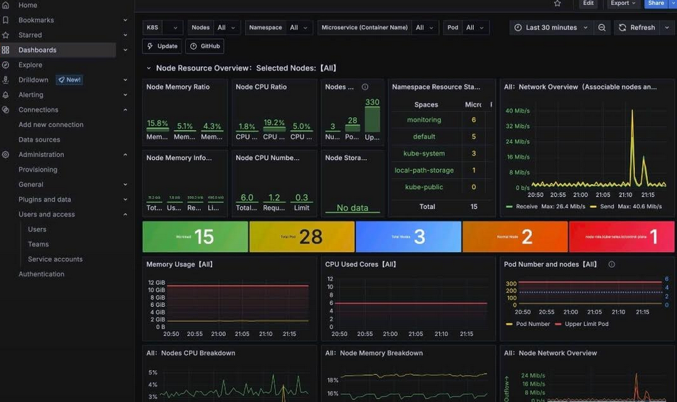

### Kapazitätsprognose im öffentlichen Nahverkehr

Im öffentlichen Nahverkehr ist es wichtig, frühzeitig zu erkennen, wenn ein Bus zu voll ist und nicht alle Fahrgäste an der Haltestelle mitnehmen kann.
Das Ziel ist, rechtzeitig zu reagieren, bevor der Bus überfüllt ist – mithilfe von Techniken, die solche Situationen vorhersagen können. Die Herausforderung besteht darin, dass eine Buslinie in beide Richtungen verkehrt. Daher ist es im Szenario vor der Entsendung eines Zusatzbusses entscheidend, alle Busse zu berücksichtigen, die bereits in beiden Fahrtrichtungen auf derselben Linie unterwegs sind. In diesem Szenario haben wir uns zuerst auf die Linie mit der höchsten Frequenz von Fahrgästen konzentriert.

  

- Projektinhalt
  1. [Architektur](./projects-Data-Analytics/Project-5-OeffentlichenVerkehr/README.md) 
  2. [Entwicklung - Datenplattform-Services](./projects-Data-Analytics/Project-5-OeffentlichenVerkehr/README.md) 
  3. [Monitoring](./projects-Data-Analytics/Project-5-OeffentlichenVerkehr/README.md) 

  

