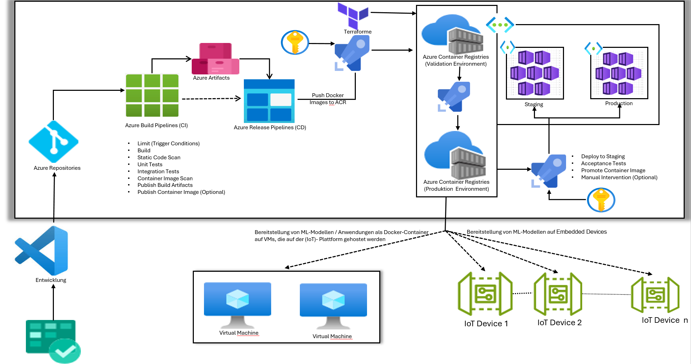

### Industrialisierung -Azure CI/CD

DevSecOps-Architektur für die automatisierte Bereitstellung containerisierter Anwendungen und Modelle von Azure auf IoT-Geräte und Kubernetes-Cluster, mit Terraform-Infrastrukturverwaltung und Staging-/Produktionsumgebungen.

---

  

