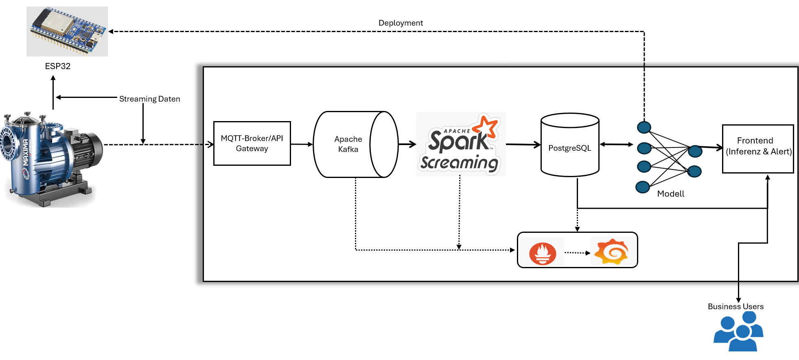

# Echtzeit-IoT-System zur Überwachung industrieller Anlagen

##  Projektbeschreibung
Dieses Projekt bietet eine IoT-basierte Lösung zur intelligenten und echtzeitfähigen Überwachung industrieller Ausrüstung. Durch den Einsatz vernetzter Sensoren misst das System kontinuierlich kritische Variablen wie Motordrehzahlen, Vibrationen, Temperatur, Druck und Durchfluss.

##  Projektziele
-  Frühzeitige Erkennung von Unregelmäßigkeiten
-  Vermeidung ungeplanter Ausfallzeiten
-  Optimierung der vorbeugenden Wartung
- Sicherstellung und kontinuierliche Überwachung der Datenqualität

---

## Architektur 

  

---
            

### Kernsysteme
-  Datenerfassung: Echtzeit-Streaming über MQTT und Kafka
-  Datenverarbeitung: Stream-Processing mit Apache Spark
-  Intelligenz: Machine-Learning- und mathematische Modelle zur Unregelmäßigkeitserkennung

### Schnittstellen & REST APIs
-  REST-APIs: Bereitstellung von Endpunkten für den Zugriff auf Echtzeit- und Verlaufsdaten  
-  Integration: Anbindung externer Systeme und Interne Services  über standardisierte Schnittstellen

### Monitoring & Visualisierung
-  Metriken: Systemüberwachung mit Prometheus & Grafana
-  Analytics: Interaktive Dashboards mit Apache Superset
-  Alerting: Automatisierte Warnmeldungen bei Schwellenwertüberschreitungen

### Infrastructure & Deployment
-  Containerisierung: Docker für Service-Isolation und Portabilität
-  Orchestrierung: Kubernetes für automatisierte Container-Verwaltung
-  Load Balancing: Verteilung der Anfragen über mehrere Instanzen

### Sicherheit & Netzwerk
-  Firewall: Netzwerksicherheit und Zugriffskontrolle
-  Security: Verschlüsselung der Datenübertragung 
-  Authentication: Sichere Benutzer- und Service-Authentifizierung

## Produktionsreife

Diese funktionellen Implementierungen erfüllen noch nicht die Anforderungen industrieller Produktionsumgebungen. Für die Umsetzung einer stabilen, performanten und langfristig betreibbaren Lösung sind weitere Entwicklungsschritte unabdingbar.