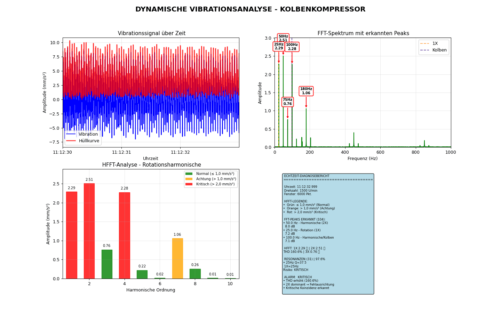

## Signalverarbeitung für Industriekompressoren

Dieses Projekt befasst sich mit der Schwingungsanalyse und Resonanzdetektion bei Industriekompressoren.  
Ziel ist die präzise Erkennung potenzieller Anomalien und Resonanzphänomene auf Basis von Vibrationsdaten in industriellen Anlagen.

---

  

---