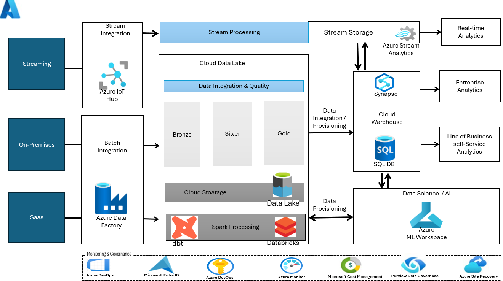
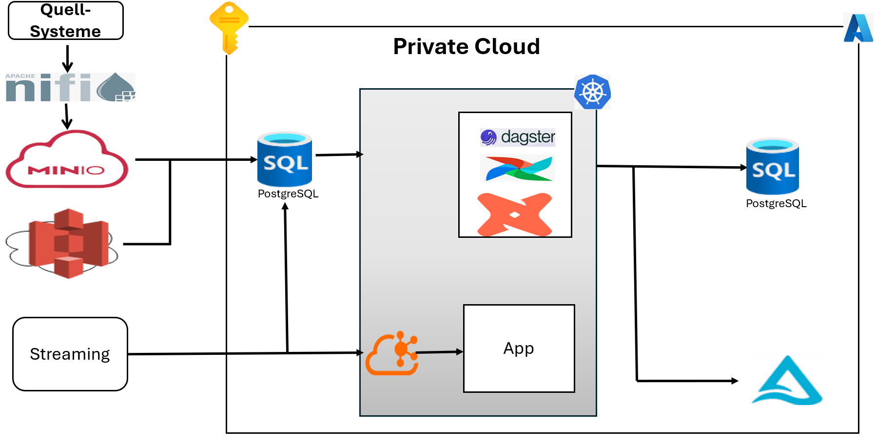
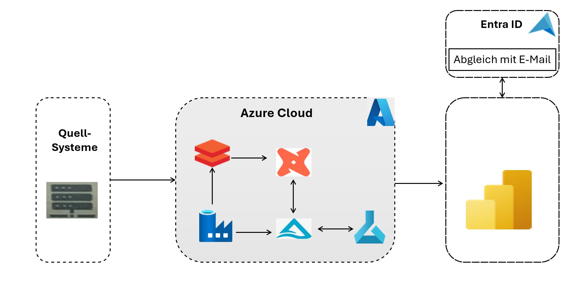
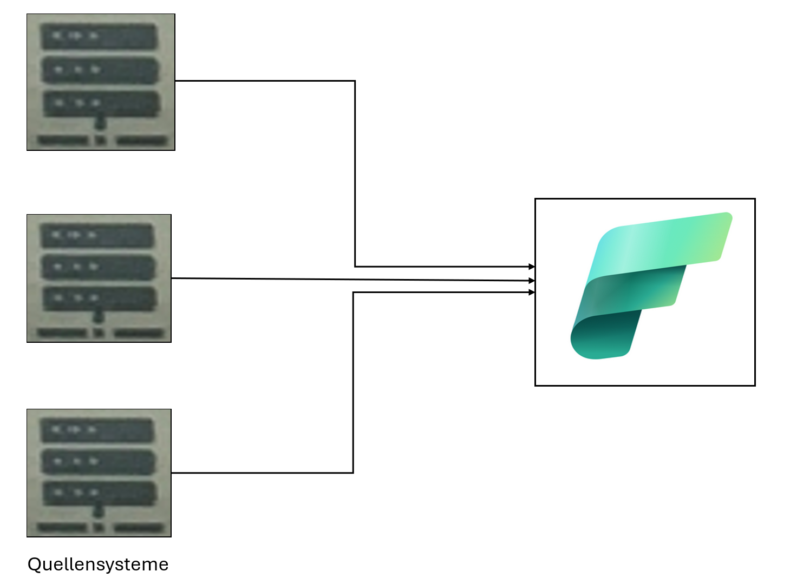
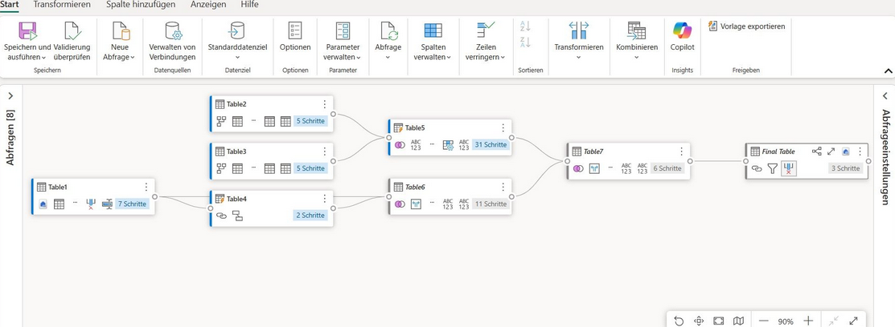

#  Projekt - Konzeption einer modernen Datenplattform

## Inhaltsverzeichnis

- [ Architekturübersicht](#architekturübersicht)
- [Projekthighlights](#projekthighlights)
- [Architekturdiagramm](#architekturdiagramm)
- [Verwendete Technologien](#verwendete-technologien)
- [Echtzeit-Datenverarbeitung mit Azure Stream Analytics](#echtzeit-datenverarbeitung-mit-azure-stream-analytics)
- [Optimierung der Datenabfragen](#optimierung-der-datenabfragen)
- [Datenmodellierung–Star Schema](#datenmodellierung-star-schema)
- [ETL-Datenflussarchitektur](#etl-datenflussarchitektur) 
- [Verwendete Werkzeuge](#verwendete-werkzeuge)

---

##  Architekturübersicht

Aufbau einer cloudbasierten Datenarchitektur auf der Azure-Plattform zur Verarbeitung, Speicherung und Analyse großer unternehmensweiter Datenmengen aus verschiedenen Quellen.

Ziel dieses Projekts ist es, eine skalierbare, zuverlässige und leistungsfähige Dateninfrastruktur zu entwerfen, die für produktive Umgebungen geeignet ist.
Die Kommunikation zwischen der Cloud-Plattform und dem lokalen (on-premise) Unternehmensnetzwerk erfolgt über sichere Kanäle, z. B. über ein VPN-Gateway, Azure ExpressRoute oder rivate Endpoints, um eine verschlüsselte und kontrollierte Datenübertragung zu gewährleisten.
Die Bereitstellung und Verwaltung der Azure-Ressourcen erfolgte automatisiert mit Terraform, um eine wiederholbare, versionierte und skalierbare Infrastruktur bereitzustellen.

---

##  Projekthighlights

- Entwicklung einer vollständigen Medallion-Architektur (Bronze → Silver → Gold)
- Nutzung von Azure Data Factory (ADF) zur Orchestrierung und Automatisierung der Datenpipelines
- Inkrementelle Datenextraktion aus Azure Data Lake Gen2
- Integration externer Datenquellen (z. B. PostgreSQL) zur Anreicherung
- Verarbeitung und Transformation mit Databricks und PySpark
- Einsatz von Delta Live Tables für skalierbares, zuverlässiges Streaming und Batch-Processing
- Modellierung eines Star Schemas für analytische Auswertungen
- Laden transformierter Daten in Azure Synapse Analytics als Data Warehouse
- Erstellung interaktiver Reports mit Power BI für Business Insights
- Sicherheitsmanagement via Azure Key Vault und rollenbasierter Zugriffskontrolle
- Versionskontrolle und Zusammenarbeit 

---

## Architektur

  

---

##  Verwendete Technologien

- Terraform 
- Networking
- Azure Data Factory (ADF)
- Azure Data Lake Gen2
- Azure Databricks + PySpark
- Delta Live Tables
- Azure Stream Analytics
- Azure Synapse Analytics
- Azure Key Vault
- Power BI
- PostgreSQL
- OpenMetadata
- Azure DevOps
- dbt (Data Build Tool)
- SQL / Python
- Medaillon Data Architecture
- Delta Lake
- Parquet Format

---

##  Echtzeit-Datenverarbeitung mit Azure Stream Analytics

Die Architektur wurde erweitert, um auch Datenströme in Echtzeit zu verarbeiten. Die folgenden Komponenten wurden integriert:

- **Stream Integration**: Aufnahme kontinuierlicher Datenströme aus verschiedenen Quellen (z. B. IoT, Telemetrie, Klickdaten)
- **Stream Processing**: Verarbeitung der Datenströme mit Azure Stream Analytics, inkl. Fensterfunktionen, Filter, Aggregationen und Joins
- **Stream Storage**: Speicherung der Streaming-Daten in Echtzeit in Azure Data Lake Gen2 oder in einem Hot Layer
- **Real-Time Analytics**: Bereitstellung von Live-Kennzahlen und Dashboards in Power BI und Azure Synapse Analytics

Diese Erweiterung ermöglicht die Analyse von Live-Daten in nahezu Echtzeit und schafft die Grundlage für reaktive Entscheidungsfindung (z. B. Alarme, Monitoring, User Experience).

---

##  Optimierung der Datenabfragen

Zur Verbesserung der Performance und Effizienz bei der Analyse großer Datenmengen wurden im Projekt folgende Optimierungsstrategien umgesetzt:

-  **Partitionierung** von Daten nach Schlüsselspalten (z. B. Datum oder Region), um Datenmengen gezielt und schneller zu verarbeiten  
- **Indexierung** für häufig abgefragte Felder, um Zugriffsgeschwindigkeit bei Abfragen zu erhöhen  
-  **Bucketing** für gleichmäßige Verteilung von Daten über Speicherblöcke und bessere Performance bei Joins  
-  **Clustering** in Databricks zur physikalischen Sortierung nach häufig genutzten Spalten  
-  Einsatz von kompakten, spaltenbasierten Dateiformaten wie Parquet und Delta Lake, um Scan-Zeit und Speicherverbrauch zu reduzieren  
-  **Predicate Pushdown** und Column Pruning, um nur relevante Daten und Spalten zu laden  
-  **Materialisierte Sichten** (Materialized Views) für vordefinierte, schnell ladbare Abfragen  
-  **Caching** von Zwischenergebnissen in Spark/Databricks für iterative Analysen  
-  **Datenkomprimierung** und Dateikonsolidierung (Compaction) zur Speicheroptimierung und Beschleunigung von Lesevorgängen

Diese Maßnahmen führten zu einer signifikanten Reduzierung der Latenzzeit bei analytischen Abfragen und verbesserten gleichzeitig die Skalierbarkeit des gesamten Datenmodells.

---

##  Datenmodellierung–Star Schema

Für den analytischen Zugriff wurde ein Star Schema implementiert, bestehend aus einer zentralen Fakten-Tabelle und mehreren Dimensionstabellen:

- Die **Fakten-Tabelle** enthält aggregierte Metriken wie z. B. Klickzahlen, Umsätze.
- **Dimensionstabellen** liefern beschreibende Informationen zu Entitäten wie:
  - Customer (ID, Name, Segment)
  - Time (Date, Week, Month)
  - Geography (Country, Region, City)
  - Product (ID, Name, Category, Brand)
  - Channel (Web, Mobile App, In-store)
  - Campaign (Campaign ID, Type, Start/End Date)
  - ...

Die Modellierung und Transformation der Daten erfolgte mit dbt (Data Build Tool), wodurch eine transparente, versionierte und dokumentierte Datenpipeline aufgebaut wurde. Zusätzlich wurden Flat Tables erstellt, um eine vereinfachte und performante Nutzung der Daten für Reporting- und Analysezwecke zu ermöglichen.

---
## ETL-Datenflussarchitektur

  

---
Jede aus MinIO extrahierte Datei wird durch das Hinzufügenn einer spezifischen Spalte angereichert, um den geschäftlichen Anforderungen gerecht zu werden. Die angereicherte Datei wird anschließend in PostgreSQL gespeichert. Nach der Speicherung transformiert DBT die Tabelle, und die transformierte Version wird erneut in PostgreSQL gespeichertt.

## Verwendete Werkzeuge

- Terraform
- ache NiFi
- MinIO
- S3
- Kafka
- PostgreSQL
- Dagster
- dbt
- Kubernetes
- Argo CD
- API 
- Application interne (App)
- Azure PostgreSQL

---

## ETL-Datenflussarchitektur

Diese Architektur beschreibt einen ETL-Datenfluss (Extrahieren, Transformieren, Laden) unter Verwendung von Microsoft Azure Cloud-Diensten. Die Daten werden aus den Quellsystemen extrahiert, transformiert und dann in einer sicheren Speicherlösung geladen. Die Authentifizierung erfolgt über Entra ID, um die Daten mit E-Mail-Adressen abzugleichen.

  

### Technologischer Stack und Prozessbeschreibung:

1. **Quellsysteme**: Extraction von Daten aus lokalen Systemen (Datenbanken oder andere Datenquellen).
2. **Azure Data Factory (ADF)**: Orchestrierung von ETL-Pipelines zur Bewegung und Transformation von Daten in Azure.
3. **DBT (Data Build Tool)**: Transformation von Daten mithilfe von SQL-Modellen in einem Data Warehouse.
4. **Azure Machine Learning**: Erstellung und Bereitstellung von Machine-Learning-Modellen zur Analyse und Vorhersage von Daten.
5. **Databricks**: Analyse und Verarbeitung großer Datenmengen in einer skalierbaren Cloud-Umgebung.
6. **Entra ID**: Verwaltung von Identitäten und Abgleich der Benutzer anhand von E-Mails.
7. **Power BI**: Visualisierung der verarbeiteten Daten für Endbenutzer.
8. **Azure Key Vault**: Sicherer Schlüsselmanagement-Dienst zur Verwaltung von Geheimnissen und Schlüsseln für die Authentifizierung.
9. **Azure Data Lake**: Speicherung und Analyse der verarbeiteten Daten.

Diese Architektur ermöglicht eine sichere und effiziente Verwaltung der Daten und sorgt für eine nahtlose Integration mit den Azure-Cloud-Services.

## Microsoft Fabric 

  

### Datentransformationsprozess in Power BI

  

## 1. Probleme in Power BI
Power BI funktioniert gut, aber wenn es darum geht, mehrere Datensätze zu verwalten, gibt es Probleme mit duplizierter Logik und verschiedenen Versionen der Daten in jedem Arbeitsbereich.

## 2. Lösung mit Microsoft Fabric
Microsoft Fabric wird als Antwort auf diese Probleme präsentiert, indem es eine skalierbare, verwaltete und wiederverwendbare Datenarchitektur ermöglicht. Dadurch wird die Verwaltung der Daten vereinfacht und zentralisiert.

## 3. Merkmale von Microsoft Fabric
- **OneLake**: Eine einzige, einheitliche Datenquelle für das Unternehmen, mit wiederverwendbarer Logik, die über Berichte, Abteilungen und Tools hinweg geteilt werden kann.
- **Lakehouse**: Eine Kombination aus der Flexibilität eines Data Lakes und der Leistung eines Data Warehouses. Es ermöglicht die Speicherung sowohl strukturierter als auch unstrukturierter Daten an einem Ort und bietet Abfragemöglichkeiten mit SQL, DAX oder Python.
- **Dataflows Gen2**: Wiederverwendbare, versionierte Datenflüsse mit modularen Transformationen und klarer Datenlinie. Sie bieten eine benutzerfreundliche ETL-Pipeline-Erfahrung.

