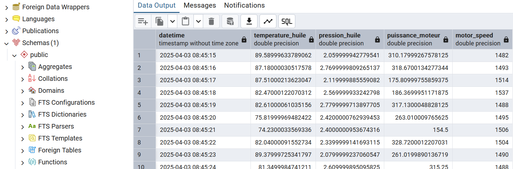

##  Skalierbare Open-Source-Plattform für Echtzeit-Datenverarbeitung und Visualisierung

###  Projektübersicht

Entwicklung eines Systems zur Echtzeit-Datenaufnahme, -verarbeitung und -visualisierung unter Verwendung moderner Open-Source-Technologien.   
Ziel des Projekts ist der Aufbau einer modularen und erweiterbaren Data-Engineering-Plattform, die sich flexibel in unterschiedliche Umgebungen integrieren lässt.   

---

###  Verwendete Technologien

- **Apache Kafka** – Streaming und Messaging  
- **Apache Airflow** – Orchestrierung von Datenpipelines  
- **Apache Spark** – Verteilte Datenverarbeitung  
- **Great Expectations** – Datenvalidierung und Qualitätssicherung  
- **PostgreSQL** – relationale Datenspeicherung & Metadaten  
- **Docker / Docker Compose** – Containerisierung  
- **Grafana** – Datenvisualisierung  

---

###  Architektur

  

Die Architektur basiert auf einem modularen Baukastenprinzip.  
Jeder Bestandteil (Ingestion, Processing, Storage, Monitoring) ist entkoppelt, um Wiederverwendbarkeit und Austauschbarkeit zu ermöglichen.

---

### Projektziele

- Standardisierte und automatisierte Datenverarbeitung  
- Unterstützung von Batch- und Echtzeitverarbeitung  
- Integrierte Datenqualitätssicherung  
- Visualisierung aktueller Daten in Dashboards  
- Einsatz ausschließlich quelloffener Komponenten

<figcaption>Streaming-Ingestion</figcaption>
  

<figcaption> Schreiben </figcaption>
  

<figcaption>Datenbank</figcaption>
  

<figcaption>Echzeit  Visualisierung</figcaption>
  

