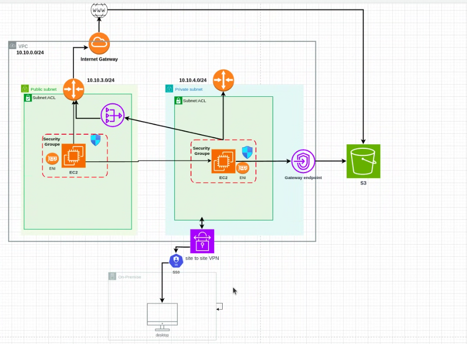
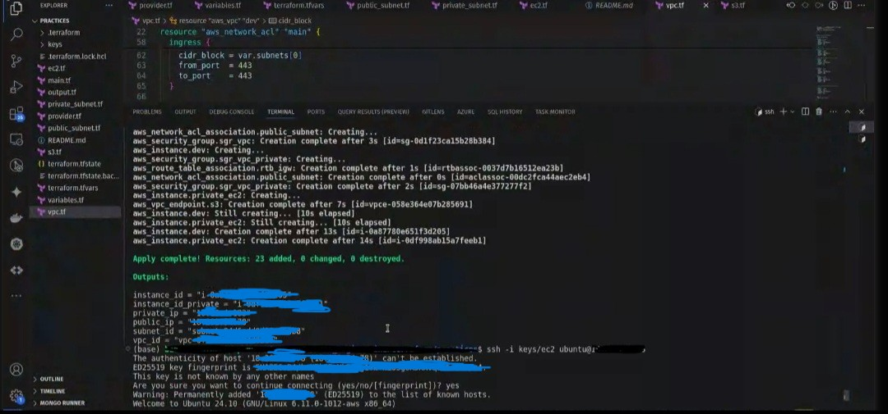

## AWS Cloud-Architektur

Diese AWS-Architektur zielt hauptsächlich darauf ab, eine sichere Cloud-Infrastruktur zum Sammeln, Speichern, Verarbeiten und Analysieren von Daten im großen Maßstab zu schaffen, während gleichzeitig eine sichere Verbindung zu bestehenden On-Premises-Systemen aufrechterhalten wird.

---
<figure style="text-align: center;">
 <figcaption style="display: block; margin-bottom: 20px;">AWS-Architekturdiagramm mit einer  Cloud-Umgebung</figcaption>
 
</figure>

---

### Verwendete Technologien
- Terraform (für Infrastructure as Code)
- VPC (Virtual Private Cloud) 
- Internet Gateway
- Öffentliches Subnetz 
- Privates Subnetz 
- ACL (Access Control Lists)
- Sicherheitsgruppen
- EC2 (Elastic Compute Cloud)
- S3 (Simple Storage Service)
- Gateway-Endpunkt
- Site-to-Site VPN
- SSO (Single Sign-On)
- On-Premises-Verbindung
- Desktop-Integration

### Datenfluss
1. Externer Datenverkehr gelangt durch das Internet-Gateway herein
2. Anwendungen im öffentlichen Subnetz können auf das Internet zugreifen
3. Anwendungen im privaten Subnetz greifen über den Gateway-Endpunkt auf S3-Ressourcen zu
4. Die VPN-Verbindung ermöglicht On-Premises-Benutzern den sicheren Zugriff auf Cloud-Ressourcen

### Sicherheitsüberlegungen
- Trennung von öffentlichen und privaten Zonen
- Verwendung von Sicherheitsgruppen zur Verkehrskontrolle
- ACLs zur Verstärkung der Netzwerksicherheit

### Terraform 

---
<figure style="text-align: center;">
 <figcaption style="display: block; margin-bottom: 20px;">Terraform </figcaption>
 
</figure>

---

## Erkannte Probleme bei der Bereitstellung von Terraform und Lösungen

### Problem 1: Deployment in falscher Umgebung

**Risiko:** Die Ausführung eines für die Entwicklungsumgebung bestimmten Terraform-Deployments in der Produktionsumgebung kann kritische Infrastruktur zerstören oder verändern.

**Lösungen:**
- Einrichtung einer robusten CI/CD-Pipeline mit getrennten Umgebungen
- Implementierung obligatorischer manueller Validierungen vor jedem Deployment in der Produktion
- Verwendung unterschiedlicher und klar benannter Umgebungsvariablen
- Konfiguration von Terraform-Workspaces zur Trennung der Zustände
- Einrichtung automatisierter Tests vor dem Deployment

### Problem 2: Versehentliche Zerstörung von Umgebungen durch Dritte

**Risiko:** Eine dritte Person oder ein Kollege könnte versehentlich `terraform destroy` ausführen und die gesamte Infrastruktur löschen.

**Lösungen:**
- Implementierung eines rollenbasierten Zugriffsverwaltungssystems (RBAC)
- Einschränkung der Berechtigungen für destruktive Befehle in sensiblen Umgebungen
- Verwendung von Zustandssperren (State Locking) zur Vermeidung gleichzeitiger Änderungen
- Aktivierung des Löschschutzes für kritische Ressourcen mit `prevent_destroy = true`
- Einrichtung regelmäßiger Backups der Terraform-Zustandsdateien
- Konfiguration von Mehrbenutzer-Genehmigungen für destruktive Operationen

### Problem 3: Verwaltung von Geheimnissen und sensiblen Informationen

**Risiko:** Offenlegung von Geheimnissen und Anmeldeinformationen im Terraform-Code.

**Lösungen:**
- Verwendung von Tresoren für Geheimnisse wie AWS Secrets Manager, HashiCorp Vault oder Azure Key Vault
- Niemals Geheimnisse im Klartext in Konfigurationsdateien speichern
- Einsatz von Umgebungsvariablen für sensible Informationen
- Einrichtung eines Tools zur Erkennung von Geheimnissen in der CI/CD-Pipeline

Durch die Befolgung dieser Grundsätze reduzieren wir  die mit der Verwendung von Terraform verbundenen Risiken erheblich und nutzen gleichzeitig die Vorteile der Infrastrukturautomatisierung optimal.