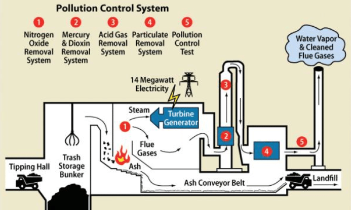

##  ÖKOEFFIZIENT - Prädiktives Emissionsmanagement
**KI-gestütztes Emissionsmanagement für Müllverbrennungsanlagen**

**Tech Stack:** Python, Machine Learning, Predictive Analytics, IoT Sensors, MLOps Pipeline, Environmental Monitoring  
**Herausforderung:** Umweltauflagen einhalten und gleichzeitig Energieeffizienz maximieren  

** Wichtige Erfolge:**
- Prädiktive Schadstoffvorhersage mit 95%+ Genauigkeit entwickelt
- Automatisierte Qualitätskontrolle und intelligentes Sortiersystem implementiert
- EU-konforme Berichterstattung vollständig automatisiert
- Energieeffizienz um 25% gesteigert bei 100% Regulatory Compliance

#### Waste-to-Energy Process Illustration

<figure style="text-align: center;">
  <figcaption style="display: block; margin-bottom: 20px;">
    Illustration: Waste-to-Energy Process
  </figcaption>
  
  <figcaption style="font-style: italic; margin-top: 10px;">
    Source: <a href="https://www.researchgate.net/figure/Flow-Chart-of-Waste-to-Energy-Generation-Process_fig3_314078184" target="_blank">
      ResearchGate – Flow Chart of Waste-to-Energy Generation Process
    </a>
  </figcaption>
</figure>

---
## Synthetische Daten für Machine Learning
**Forschungsprojekt zur Optimierung von ML-Modellen mit künstlichen Datensätzen**

**Tech Stack:** Python, Synthetic Data Generation, Data Quality Framework, ML Model Evaluation  
**Herausforderung:** Datenknappheit in ML-Projekten durch hochqualitative synthetische Daten lösen  

** Wichtige Erfolge:**
- Umfassendes Data Quality Assessment Framework entwickelt
- Leistungsvergleich: Synthetische vs. reale Daten in ML-Modellen durchgeführt  
- Best-Practice-Leitfaden für synthetische Datennutzung erstellt
- Modellgenauigkeit bei 80% weniger realen Trainingsdaten erreicht

---

## Actuarial Risk Modeling - Kfz-Versicherung
**Prädiktive Schadenhöhenmodellierung für faire Versicherungsbeiträge**

**Tech Stack:** Python, Statistical Modeling, Actuarial Science, Feature Engineering, MLops Pipeline, Model Validation
**Herausforderung:** Faire Versicherungsbeiträge basierend auf Kundenrisikomerkmalen berechnen  

** Wichtige Erfolge:**
- Explorative Datenanalyse von Kfz-Haftpflicht-Versicherungsdaten durchgeführt
- Feature Engineering für Risikomerkmale und Schadeninformationen optimiert
- Vergleichende Modellanalyse mit statistischen Metriken implementiert
- Prädiktives Modell für erwartete Schadenhöhe pro Kunde/Jahr entwickelt
- **Model Deployment Pipeline** für Produktionsumgebung aufgebaut
- **Kontinuierliches Monitoring** für Model Drift und Performance-Überwachung eingerichtet
- Modellinterpretation für Transparenz in Beitragskalkulation sichergestellt

**Methodischer Ansatz:**
- **Explorative Datenanalyse:** Identifikation statistischer Zusammenhänge und Datenqualitätsprobleme
- **Feature Engineering:** Optimierung der Risikomerkmale für Modellierung
- **Modellvergleich:** Systematische Evaluation verschiedener Ansätze mit Validierungsmetriken
- **Model Building:** Training des finalen Modells mit Fokus auf faire Beitragskalkulation
- **Deployment & Monitoring:** Produktive Bereitstellung mit automatisierter Überwachung

---

## HEIZOPTIM - Intelligente Heizungssteuerung
**MLOps-Pipeline für adaptive Gebäudetemperaturoptimierung**

**Tech Stack:** Python, IoT, Time Series Analysis, MLOps, Predictive Modeling, Statistical Optimization  
**Herausforderung:** Energieverbrauch reduzieren ohne Komfortverlust in Wohngebäuden  

** Wichtige Erfolge:**
- Selbstlernende Heizkurven-Optimierung mit statistischen Methoden entwickelt
- Intelligente Nachtabsenkung basierend auf Nutzerverhalten implementiert
- Vollständige MLOps-Pipeline für skalierbare Deployment aufgebaut
- Energieeinsparung von 30%+ durch prädiktive Steuerungsalgorithmen erreicht

---