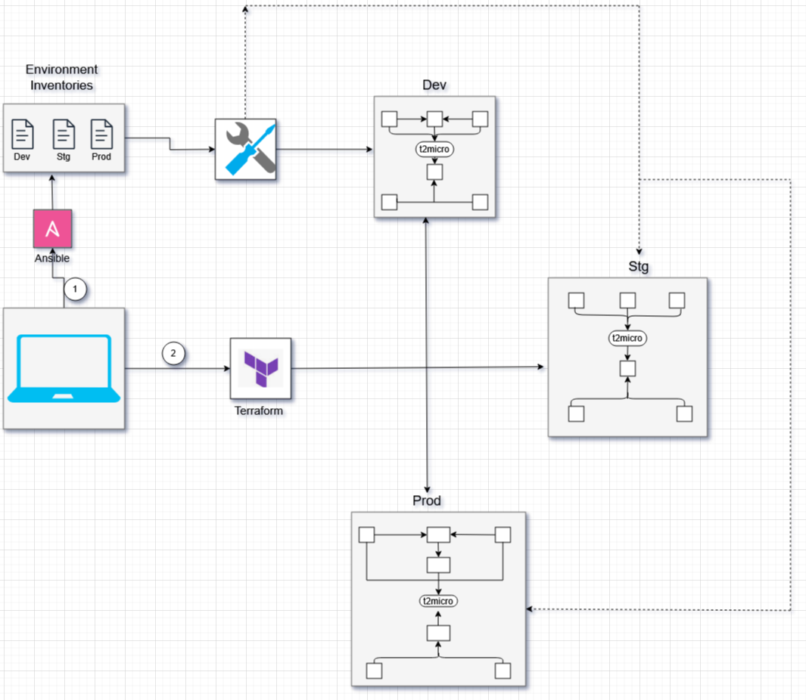

### Automatisierte Infrastruktur-Bereitstellung

Automatisierung der Infrastruktur-Provisionierung über mehrere Umgebungen (Dev, Stg, Prod). Durch den Einsatz von Terraform als Infrastructure-as-Code Tool wird eine konsistente, reproduzierbare und skalierbare Bereitstellung von Cloud-Ressourcen ermöglicht.

---

  2" width="700"/>

